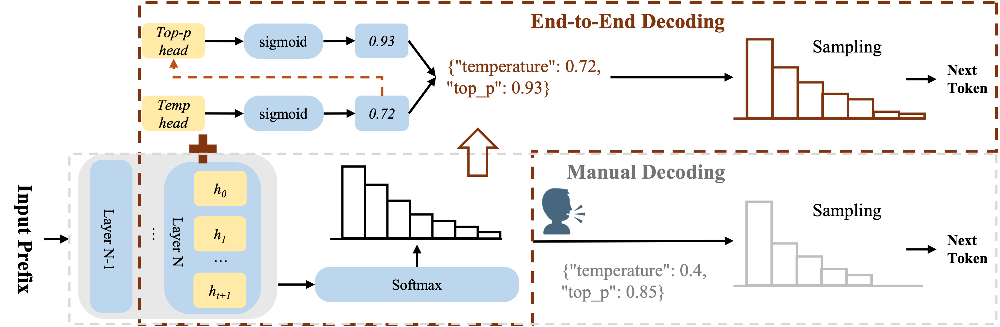

# AutoDeco
Official Implementation of "THE END OF MANUAL DECODING: TOWARDS TRULY END-TO-END LANGUAGE MODELS"

**AutoDeco** is a framework that adds token-level adaptive decoding parameter prediction capabilities to Large Language Models (LLMs). By adding lightweight prediction heads on top of pre-trained models, AutoDeco can dynamically predict optimal temperature and top-p parameters for each token during decoding.

## 🎯 Key Features

- **Token-Level Decoding Parameter Prediction**: Dynamically predict decoding parameters (temperature and top-p) for each generated token
- **Lightweight Design**: Only adds two small MLP prediction heads (~5MB), without modifying the base model
- **Universal Architecture**: Supports multiple mainstream LLM architectures (Llama, Qwen2/2.5, Qwen3, MoE models, etc.)
- **End-to-End Training**: Complete training with implicit gradient backpropagation through cross-entropy loss only 
- **Flexible Training**: Supports independent training of temperature head, top-p head, or joint training
- **Efficient Deployment**: Only saves AutoDeco prediction head weights during training, merges with base model during Auto

## 📋 Table of Contents

- [Architecture](#architecture)
- [Supported Models](#supported-models)
- [Installation](#installation)
- [Quick Start](#quick-start)
- [Training](#training)
- [Evaluation](#evaluation)
- [Project Structure](#project-structure)

## 🏗️ Architecture

The AutoDeco framework consists of two core components:



### Model Workflow

```
Input Tokens
    ↓
Base LLM (frozen during head training)
    ↓
Hidden States
    ├──→ LM Head → Logits
    ├──→ TempHead → Temperature
    └──→ TopPHead → Top-P
```

During training, the base LLM parameters are frozen, and only the two prediction heads are trained.

## 🤖 Supported Models

AutoDeco supports all current LLMs, and we unified them with the following model architectures `AutoDecoModelForCausalLM` interface.

We have released the AutoDeco Head below:

- ✅ **Llama** (Llama 3.1-8B-Nemotron)
- ✅ **Qwen2.5** (DeepSeek-R1-Distill-Qwen-7B)
- ✅ **Qwen3** (Qwen3-8B)
- ✅ **Qwen3-MoE** (Qwen3-30B-A3B-Instruct-2507)
- Other models supported by HuggingFace `AutoModelForCausalLM`

Theoretically, any Transformer-based causal LM can be seamlessly integrated with AutoDeco.

## 🚀 Installation

### Requirements

- Python >= 3.8
- PyTorch >= 2.0
- CUDA >= 11.8 (recommended for training)

### Install Dependencies

```bash
# Clone repository
cd AutoDeco

# Install core dependencies
pip install torch transformers accelerate
pip install datasets trl deepspeed
pip install safetensors vllm

# Optional: for training monitoring
pip install swanlab wandb
```

## 💡 Quick Start

### 1. Load Pre-trained AutoDeco Model

```python
from model.templlm_auto import AutoDecoModelForCausalLM

# Load from AutoDeco checkpoint (with trained heads)
model = AutoDecoModelForCausalLM.from_pretrained(
    "path/to/autodeco_checkpoint",
    trust_remote_code=True
)

# Or create new AutoDeco model from base model
model = AutoDecoModelForCausalLM.from_pretrained(
    "meta-llama/Llama-3.1-8B",
    train_temp=False,      # Don't train temperature head
    train_top_p=False,     # Don't train top-p head
    use_enhanced_features=True
)
```

### 2. Inference

```python
from transformers import AutoTokenizer

tokenizer = AutoTokenizer.from_pretrained("path/to/model")
inputs = tokenizer("What is the meaning of life?", return_tensors="pt")

# Forward pass to get predictions
outputs = model(**inputs)

# outputs contains:
# - outputs.logits: Regular language model logits
# - outputs.temp_logits: Predicted temperature values
# - outputs.top_p_logits: Predicted top-p values
```

### 3. Efficient Inference with vLLM

AutoDeco can be integrated with vLLM for efficient batch inference:

```bash
# Use training script for evaluation
python llm_eval.py \
    --model_name_or_path path/to/autodeco_model \
    --dataset aime24 \
    --temp 1.0 \
    --top_p 1.0 \
    --k 16 \
    --tp_size 4
```

## 🔥 Training

### Prepare Training Data

Training data should be in JSONL format, with one sample per line. AutoDeco supports standard conversation format:

```json
{
  "messages": [
    {"role": "user", "content": "Question content"},
    {"role": "assistant", "content": "Answer content"}
  ]
}
```

Or direct prompt format:

```json
{
  "prompt": "formatted prompt text",
  "completion": "expected completion"
}
```

### Train AutoDeco Heads

Use the provided training script:

```bash
# Edit script/trl_train.sh to configure parameters
# Key parameters:
# - MODEL_NAME_OR_PATH: Base model path
# - DATA_NAME: Training data filename (in data/shortest_reasoning/ directory)
# - MAX_LENGTH: Maximum sequence length
# - train_temp: Whether to train temperature head
# - train_top_p: Whether to train top-p head

bash script/trl_train.sh
```

Training configuration examples:

```bash
# Train only temperature head
accelerate launch trl_train.py \
    --model_name_or_path meta-llama/Llama-3.1-8B \
    --dataset_name train_data.jsonl \
    --train_temp true \
    --train_top_p false \
    --learning_rate 5e-6 \
    --num_train_epochs 1 \
    --output_dir ckpt/llama3_temp_head

# Joint training of both heads
accelerate launch trl_train.py \
    --model_name_or_path meta-llama/Llama-3.1-8B \
    --dataset_name train_data.jsonl \
    --train_temp true \
    --train_top_p true \
    --learning_rate 5e-6 \
    --output_dir ckpt/llama3_autodeco
```

### Training Parameters

Core training parameters are defined in `trl_train.py` through `TempLLMScriptArguments`:

- `--train_temp`: Whether to train temperature head (default: False)
- `--train_top_p`: Whether to train top-p head (default: False)
- `--use_enhanced_features`: Whether to use enhanced features in top-p head (default: True)

When both are False, standard language model training (fine-tuning base model) is performed.

### Loss Functions

**Key Innovation: Single Cross-Entropy Loss for End-to-End Training**

AutoDeco requires **only the standard cross-entropy loss** - no additional loss functions needed:

#### Temperature Loss
Uses temperature-scaled cross-entropy with implicit gradient flow:
- Temperature head receives gradients through standard LM loss
- For positions where the model already predicts correctly, randomly drop 60% to avoid overfitting
- Weight the loss using the base model's confidence in the GT token
- **No separate temperature loss function required**

#### Top-P Loss (Soft)
Uses the same cross-entropy loss with soft top-p sampling:
- Smoothly clips probability distribution through exponential decay
- Top-p head learns optimal thresholds through standard language modeling objective
- **No separate regression loss needed** - gradients flow through cross-entropy
- Both heads trained jointly with a single loss function

## 📊 Evaluation

### Batch Evaluation with vLLM

```bash
# Single evaluation
python llm_eval.py \
    --model_name_or_path ckpt/autodeco_model \
    --dataset aime24 \
    --temp 1.0 \
    --top_p 1.0 \
    --k 16 \
    --seed 42

# Batch evaluation with script (automatically generates multiple random seeds)
bash script/test_generation.sh aime24 1.0 1.0 -1 1.0 path/to/model
```

Evaluation results are saved in the `generation_log/` directory, including:
- Pass@K metrics
- Average accuracy
- Detailed generation results for each sample

### Supported Evaluation Datasets

Evaluation data should be placed in the `data/TempTest/` directory in JSONL format:

```json
{
  "problem": "Question text",
  "gt": "Standard answer"
}
```

## 📁 Project Structure

```
AutoDeco/
├── model/                          # Model definitions
│   ├── templlm_auto.py            # Unified AutoDeco model (recommended)
│   ├── templlm_llama.py           # Llama-specific implementation
│   ├── templlm_qwen2_5.py         # Qwen2.5-specific implementation
│   ├── templlm_qwen3.py           # Qwen3-specific implementation
│   ├── templlm_qwen3_moe.py       # Qwen3-MoE-specific implementation
│   └── temp_model.py              # Core component definitions
│
├── trainer/                        # Trainers
│   └── trl_Temp.py                # AutoDeco trainer
│
├── script/                         # Scripts
│   ├── trl_train.sh               # Training launch script
│   ├── test_generation.sh         # Batch evaluation script
│   ├── extract_heads.py           # Extract heads weights
│   └── merge_head.py              # Merge heads to base model
│
├── config/                         # Configuration files
│   └── deepspeed/                 # DeepSpeed configuration
│       └── deepspeed_zero3_gradaccu4.yaml
│
├── trl_train.py                   # Training main program
├── llm_eval.py                    # Evaluation main program (vLLM)
├── merge_autodeco.py              # Model merging script
├── boxed_extract.py               # Answer extraction tool
└── README.md                      # This document
```

## 🔧 Advanced Usage

### 1. Extract AutoDeco Heads

After training, you can save only the heads weights:

```python
from model.templlm_auto import AutoDecoModelForCausalLM

model = AutoDecoModelForCausalLM.from_pretrained("ckpt/trained_model")

# save_pretrained defaults to saving only heads
model.save_pretrained("ckpt/autodeco_heads_only")
```

This generates a lightweight checkpoint (~5MB) containing:
- `config.json`: AutoDeco configuration (including base_model_name_or_path)
- `autodeco_heads.safetensors`: Heads weights

### 2. Merge to Base Model (for vLLM Deployment)

If you need to create a complete model file with heads for inference engines like vLLM:

```bash
python merge_autodeco.py \
    --base_model path/to/base_model \
    --heads_checkpoint path/to/autodeco_heads \
    --output_dir path/to/merged_model
```

### 3. Custom Training Configuration

Modify `config/deepspeed/deepspeed_zero3_gradaccu4.yaml` to adjust DeepSpeed configuration:

```yaml
compute_environment: LOCAL_MACHINE
gradient_accumulation_steps: 4
zero_stage: 3
offload_optimizer_device: none
offload_param_device: none
```


## 📝 Citation

If you use AutoDeco in your research, please cite:

```bibtex
@software{autodeco2025,
  title={THE END OF MANUAL DECODING: TOWARDS TRULY END-TO-END LANGUAGE MODELS},
  author={Zhichao Wang, Dongyang Ma, Xinting Huang, Deng Cai, Tian Lan, Jiahao Xu, Haitao Mi, Xiaoying Tang, Yan Wang},
  year={2025},
  url={https://github.com/yourusername/AutoDeco}
}
```

## 🤝 Contributing

Welcome to submit Issues and Pull Requests!

## 📄 License

This project is licensed under the Apache 2.0 License. See LICENSE file for details.

## 🙏 Acknowledgments

- Built on [Transformers](https://github.com/huggingface/transformers) and [TRL](https://github.com/huggingface/trl)
- Training framework uses [DeepSpeed](https://github.com/microsoft/DeepSpeed)
- Inference optimization uses [vLLM](https://github.com/vllm-project/vllm)


 
